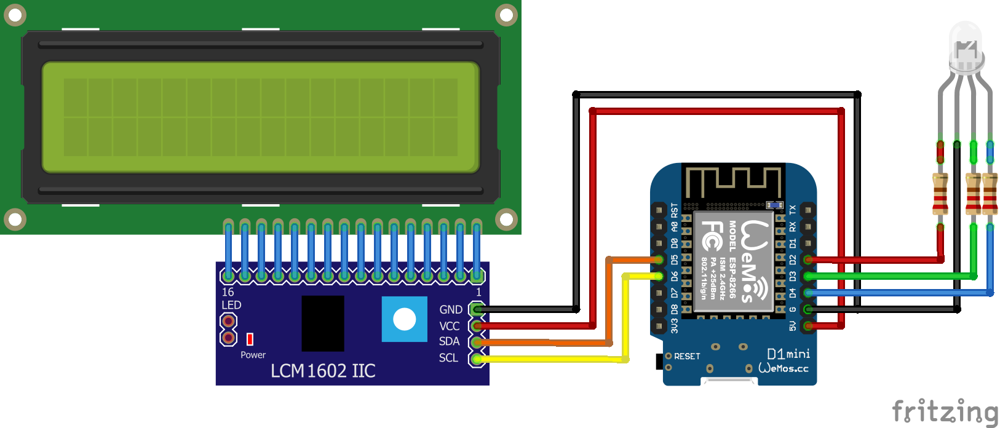

# RGBCalendar
Gateway to get my Google Calendars events and send them back to my micro-controller to display them because I never pay attention to my calendar (aka. an over complicated way to replace notifications).

# Disclaimer
None of the shopping links listed below are promoted. They are just a personal selection based on the fact that they were the first one to show up after a (too) quick google search. They are definitely not the best, and therefore cannot be taken accountable for any inconvinience.

# Getting started

## Material

- A computer with [Node.js installed](https://nodejs.org/en/download/) connected to an accessible WiFi network nad the driver installed for your micro-controller.
- A WiFi compatible micro-controller (ex: [esp8266](https://www.amazon.com/HiLetgo-Internet-Development-Wireless-Micropython/dp/B081CSJV2V?th=1), [esp32](https://www.amazon.com/MELIFE-Development-Dual-Mode-Microcontroller-Integrated/dp/B07Q576VWZ/ref=sr_1_3?dchild=1&keywords=esp32&qid=1585891239&s=electronics&sr=1-3), [Arduino Uno WiFi](https://store.arduino.cc/usa/arduino-uno-wifi-rev2))
- A LCD I2C 16x2 (or to convinience) screen (that can be found [here](https://www.amazon.com/SunFounder-Serial-Module-Display-Arduino/dp/B019K5X53O))
- A RGB LED (that can be found [here](https://www.amazon.com/Diffused-Multicolor-Common-Cathode-Arduino/dp/B01FDD3B72/ref=sr_1_1?crid=2TPV8GNF82T2J&dchild=1&keywords=rgb+led+diode&qid=1585891715&s=electronics&sprefix=rgb+led+%2Celectronics%2C223&sr=1-1))

## Google Calendar
In order to make this work, you must grant access to your google calendar to that server.
Simpy follow the instructions on this [link](https://developers.google.com/calendar/auth#OAuth2Authorizing). 
Once done, create a folder named `configure` and add the credentials.json file that you have downloaded from the previous instructions.

## The Server

### Run RGB
Before starting the server it would be smart to install the package by using the `npm install` command.
Then just run `npm run start` in the root of the project to start the server.

### Auth
In order to let the micro-controller access the data in a minimalistic secure manner, a 16bit hexadecimal key is generated once at the first launch of the server. You will have to add this key in the `#define TOKEN ""` in the RGBCalendar.ino (see [Modify the .ino code](#modifying-the-ino-code)).

You can regenerate a key any time by running `npm run gen`.

Once started, the server should display the token.

## Schema

The following schema shows you how to connect the different electronic parts.


## Modifying the .ino code

In order to make your micro-controller compatible to the project and your setting, you need to modify the .ino code.

- First you must modify the WiFi information to your configutation. 
  ```c++
  4 |    #define SSID "SSID"                       // Modify to your WiFi's name
  5 |    #define PSWD ""                           // Modify to your WiFi's password
  ```
- Add the token generated from the server and the server's IP address and port.
  ```c++
  6 |    #define SERVER  "xxx.xxx.xxx.xxxx:8080"   // Modify to your server's IP
  7 |    #define TOKEN   ""                        // Modify to your generated token
  ```

Then enjoy.